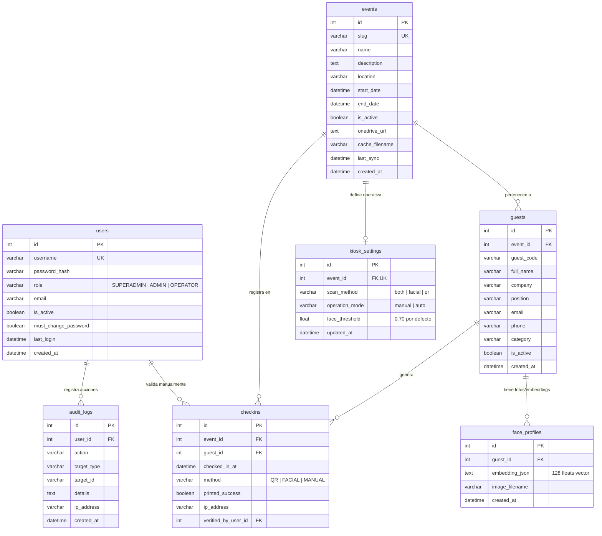
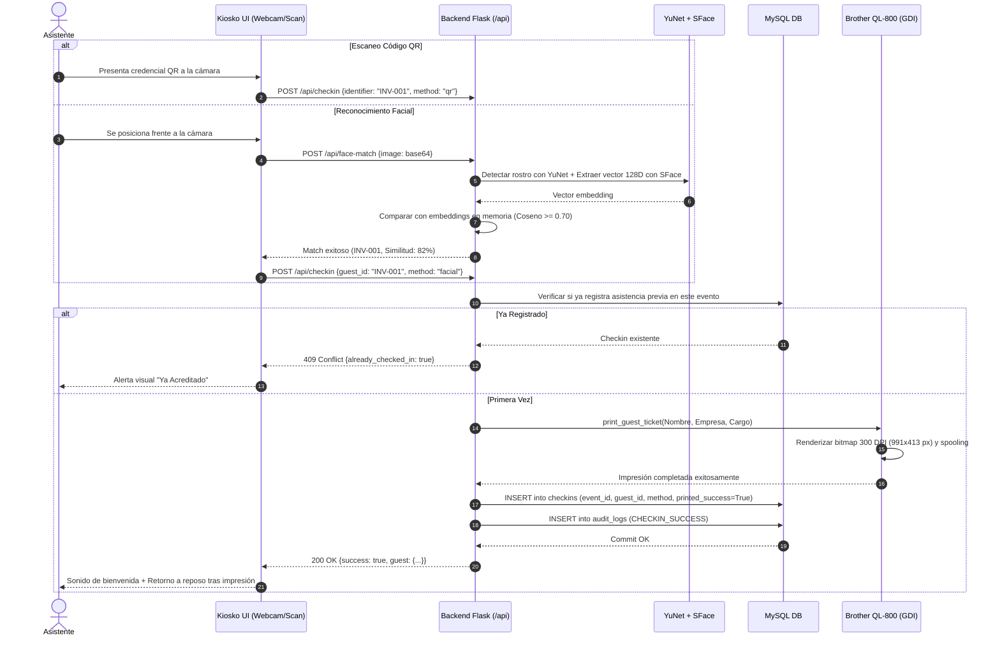
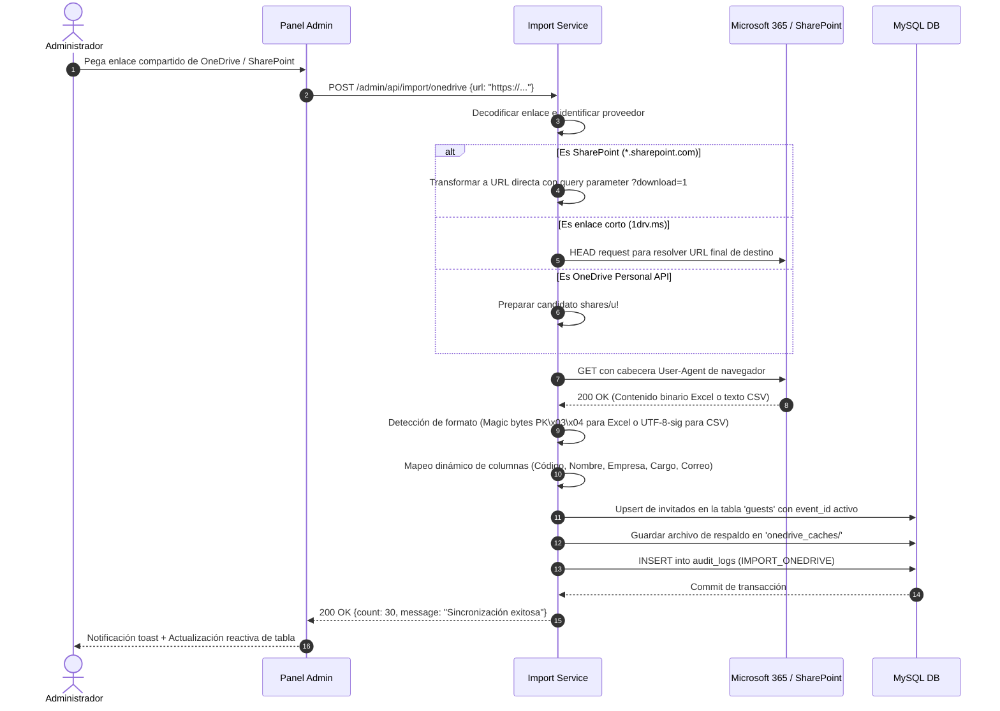
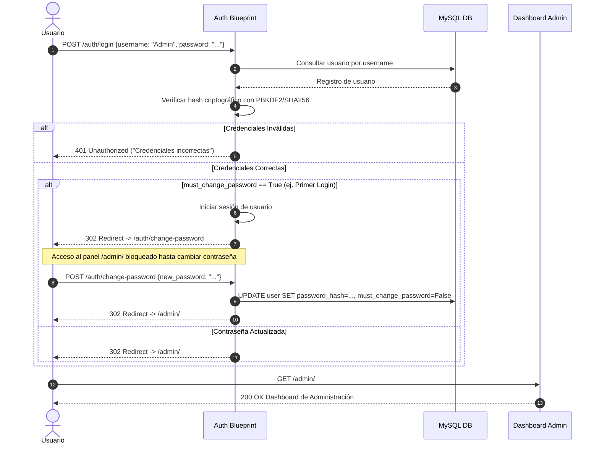

#  Documentación Técnica y Arquitectura del Sistema CheckIn-DACER
## Rama: `feature/mysql-security-architecture`

---

## 1. Resumen Ejecutivo

La rama `feature/mysql-security-architecture` representa la evolución del sistema **CheckIn-DACER** desde un prototipo monolítico basado en archivos planos (`CSV`, `JSON`) hacia una **plataforma empresarial robusta, escalable y segura**, respaldada por el motor de base de datos relacional **MySQL**.

Esta versión implementa una arquitectura modular desacoplada en tres capas (Modelos, Servicios y Controladores/Blueprints), con autenticación de usuarios basada en roles (RBAC), registro forense de auditoría inmutable, gestión multi-evento, cuatro métodos de carga de asistentes (incluyendo enlaces corporativos de OneDrive/SharePoint con resolución automática de descarga) y un motor biométrico de reconocimiento facial con umbral de alta precisión (**0.70**).

---

## 2. Stack Tecnológico

| Capa | Tecnología / Librería | Versión / Detalle | Propósito |
| :--- | :--- | :--- | :--- |
| **Backend Core** | **Python** + **Flask** | Python 3.10+, Flask 3.x | Framework de servidor web rápido, modular y extensible. |
| **Arquitectura Web** | **Flask Blueprints** | `admin`, `api`, `auth`, `kiosk` | Modularización de controladores por contexto funcional. |
| **Base de Datos** | **MySQL Server** | 8.0+ / 8.4 LTS (InnoDB) | Motor relacional transaccional ACID en puerto 3306. |
| **ORM & Conector** | **Flask-SQLAlchemy** + **PyMySQL** | SQLAlchemy 2.0+ / PyMySQL | Mapeo objeto-relacional, pools de conexión y migraciones. |
| **Autenticación** | **Flask-Login** + **Werkzeug** | `pbkdf2:sha256` / `scrypt` | Sesiones HTTP seguras, hashing de contraseñas y control de acceso. |
| **Protección Web** | **Flask-WTF** (CSRF) + **Flask-Limiter** | Tokens CSRF + Rate Limiting | Mitigación contra ataques CSRF, fuerza bruta y abuso de APIs. |
| **IA Biometría Facial** | **OpenCV DNN** (`YuNet` + `SFace`) | Modelos ONNX cuantizados | Detección (YuNet) y extracción de embeddings de 128D (SFace) en CPU. |
| **Hardware e Impresión**| **pywin32** (`win32print`, `win32ui`, `win32gui`) | Spooler GDI de Windows | Impresión térmica nativa a 300 DPI sin diálogos en Brother QL-800. |
| **Detección de Hardware**| **WMI** (`wmi` python package) | Windows Management Instrumentation | Detección en vivo de conexión física USB y estado de la impresora. |
| **Manipulación de Datos**| **openpyxl** + **csv** | openpyxl 3.1+ | Lectura/escritura de Excel `.xlsx` y parseo de CSV multi-codificación. |
| **Frontend Kiosko** | **HTML5**, **CSS3 Vanilla**, **JavaScript ES6+** | Sin frameworks externos | Interfaz de pantalla completa táctil ultra rápida con `jsQR`. |
| **Frontend Admin** | **CSS Moderno**, **Flexbox/Grid**, **Fetch API** | Dashboard reactivo | Panel administrativo con métricas en tiempo real y modales interactivos. |

---

## 3. Arquitectura del Software

El sistema sigue el patrón de diseño **Application Factory** y una arquitectura en capas **MVC / Service-Oriented**, garantizando que la lógica de negocio esté aislada de las rutas HTTP y de la persistencia de datos.

```
c:\Users\braya\PROYECTS\Checkin-Demo\
├── app/
│ ├── blueprints/ # Capa de Controladores (Routing)
│ │ ├── admin/routes.py # Dashboard, métricas, eventos, usuarios, importaciones
│ │ ├── api/routes.py # APIs de check-in, kiosko, biometría y hardware
│ │ ├── auth/routes.py # Login, logout y cambio forzado de contraseña
│ │ └── kiosk/routes.py # Vista de pantalla completa del tótem de acreditación
│ ├── models/ # Capa de Persistencia (Modelos SQLAlchemy)
│ │ ├── audit_log.py # Registro forense de acciones y seguridad
│ │ ├── checkin.py # Asistencias acreditadas por evento
│ │ ├── event.py # Eventos del sistema y metadatos de sincronización
│ │ ├── face_profile.py # Embeddings biométricos (128 floats serializados)
│ │ ├── guest.py # Asistentes e invitados
│ │ ├── kiosk_setting.py # Configuración operativa (modo, método, umbral)
│ │ └── user.py # Usuarios del panel (SUPERADMIN, ADMIN, OPERATOR)
│ ├── services/ # Capa de Lógica de Negocio
│ │ ├── audit_service.py # Emisión de logs forenses
│ │ ├── face_service.py # Detección, enrolamiento y matching con YuNet/SFace
│ │ ├── guest_service.py # Gestión de asistentes, eventos y configuración de kiosko
│ │ ├── import_service.py # Resolvedor de OneDrive/SharePoint y parseo Excel/CSV
│ │ └── printer_service.py # Spooler GDI Windows y renderizado térmico DK-1208
│ ├── config.py # Configuración global centralizada (entornos, rutas, flags)
│ ├── extensions.py # Instancias de SQLAlchemy, LoginManager, CSRF y Limiter
│ └── __init__.py # Application Factory (`create_app`)
├── models/ # Modelos ONNX de Redes Neuronales
│ ├── face_detection_yunet_2023mar.onnx
│ └── face_recognition_sface_2021dec.onnx
├── templates/ # Plantillas Jinja2
│ ├── admin/admin.html # Dashboard administrativo
│ ├── auth/login.html # Pantalla de acceso seguro
│ ├── auth/change_password.html # Cambio obligatorio de contraseña
│ └── kiosk/index.html # Pantalla principal del kiosko
├── run.py # Punto de entrada de ejecución del servidor
└── test_full_system.py # Suite completa de verificación y tests de integración
```

---

## 4.  Modelo de Datos Relacional (MySQL)

La base de datos `checkin_dacer_db` utiliza el motor **InnoDB** con codificación `utf8mb4` para soporte íntegro de caracteres multilenguaje, tildes y símbolos.

### 4.1 Diagrama Entidad-Relación (Mermaid)



---

## 5. Flujos de Datos del Sistema

### 5.1 Flujo de Acreditación en Kiosko (QR / Facial e Impresión)



---

### 5.2 Flujo de Sincronización OneDrive / SharePoint



---

### 5.3 Flujo de Seguridad y Autenticación Administrativa



---

## 6. Detalle de Módulos y Servicios

### 6.1 `app/services/face_service.py` (Biometría Facial con OpenCV DNN)
- **Modelos integrados**:
 - `face_detection_yunet_2023mar.onnx`: Detector facial ultraligero que retorna bounding box y 5 puntos de referencia (ojos, nariz, comisuras).
 - `face_recognition_sface_2021dec.onnx`: Extractor de características faciales que genera un vector normalizado de 128 dimensiones.
- **`match_face(img_bgr, threshold=0.70)`**:
 - Compara el vector del rostro detectado contra la caché en memoria usando similitud de Coseno.
 - **Umbral por defecto**: `0.70`. Asegura máxima especificidad biométrica evitando coincidencias erróneas.
 - **Margen de ambigüedad**: Exige `(best_sim - top2_sim) >= 0.05` para descartar rostros ambiguos entre asistentes similares.
- **`reload_embeddings_from_db(event_id)`**:
 - Filtra los perfiles de la tabla `face_profiles` vinculados únicamente al evento activo.
 - Al cambiar de evento en el panel, se ejecuta automáticamente liberando memoria y cargando únicamente a los asistentes del evento actual.

### 6.2 `app/services/import_service.py` (Motor de Ingesta Multi-Origen)
- **Resolvedor Inteligente de SharePoint / OneDrive**:
 - Genera lista ordenada de URLs candidatas de descarga directa.
 - Detecta dominios corporativos `sharepoint.com` y anexa automáticamente `?download=1`.
 - Decodifica tokens de redirección `shares/u!` previniendo el error `HTTP 308 (User migrated)`.
 - Inyecta cabeceras `User-Agent` de navegador para sortear bloqueos de bots.
- **Parseador Universal CSV y Excel**:
 - **Excel**: Procesa archivos `.xlsx` nativos vía `openpyxl`.
 - **CSV**: Detección automática de delimitadores (`,`, `;`, `\t`) mediante `csv.Sniffer`.
 - **Codificaciones soportadas**: `utf-8-sig`, `utf-8`, `cp1252`, `latin-1`, `iso-8859-1`. Resuelve discrepancias de apertura en Excel en español (tildes y `ñ`).
- **Mapeo Inteligente de Columnas**: Identifica de forma insensible a mayúsculas/minúsculas y acentos las columnas `Código/ID`, `Nombre Completo`, `Empresa`, `Cargo`, `Correo` y `Teléfono`.

### 6.3 `app/services/printer_service.py` (Spooler GDI Windows)
- **Renderizado Térmico a 300 DPI**:
 - Lienzo horizontal de **991 × 413 píxeles** correspondiente al formato **DK-1208 (38 mm × 90.3 mm)**.
 - Generación de tipografía de alta fidelidad con PIL / Pillow (`truetype`).
 - Algoritmo de partición de nombres largos en dos líneas equilibradas y ajuste automático de tamaño (`fit_font`).
- **Control Directo con `win32print`**:
 - Envío directo al spooler de Windows sin cuadros de diálogo nativos (`StartDocPrinter`, `StartPagePrinter`, `WritePrinter`, `EndPagePrinter`, `EndDocPrinter`).
 - Purga de trabajos atascados con `purge_printer_queue()`.
 - Consulta de conectividad USB y estado en tiempo real vía WMI y Windows API.

### 6.4 `app/services/guest_service.py` (Gestor de Eventos y Asistentes)
- **Gestión Multi-Evento**:
 - `create_event()`: Crea eventos con slug auto-generado y textos de bienvenida para el kiosko.
 - `set_active_event(event_id)`: Marca el evento activo en la base de datos y desencadena la recarga de perfiles biométricos en `face_service`.
 - `get_event_stats(event_id)`: Agregación SQL para calcular en milisegundos asistentes totales, registrados, pendientes y porcentaje de avance.
- **Configuración del Kiosko**:
 - Persistencia de `KioskSetting` en MySQL (método de escaneo: `both`, `facial`, `qr`; modo: `manual`, `auto`; umbral: `face_threshold = 0.70`).

---

## 7.  Políticas de Seguridad Implementadas

1. **Gestión Criptográfica de Contraseñas**:
 - Algoritmo PBKDF2 con HMAC-SHA256 y salting individual de alta entropía. Nunca se almacenan contraseñas en texto plano.
2. **Primer Login Obligatorio con Cambio de Clave**:
 - El usuario inicial `Admin` nace con la clave temporal `000000` y `must_change_password=True`.
 - Cualquier solicitud a rutas administrativas es interceptada por el middleware `@admin_bp.before_request`, bloqueando el acceso hasta que se establezca una contraseña segura.
3. **Control de Acceso Basado en Roles (RBAC)**:
 - `SUPERADMIN`: Acceso total, gestión de eventos, creación/eliminación de usuarios administrativos.
 - `ADMIN`: Gestión de eventos, carga de invitados, enrolamiento facial y configuración de hardware.
 - `OPERATOR`: Visualización y marcación manual de asistencia en mesas de acreditación.
4. **Auditoría Forense Inmutable (`audit_logs`)**:
 - Cada acción sensible (`LOGIN_SUCCESS`, `PASSWORD_CHANGE`, `EVENT_CREATE`, `IMPORT_ONEDRIVE`, `CHECKIN_MANUAL`, `CHECKIN_CANCEL`, `USER_CREATE`, `USER_DELETE`) se almacena con ID de usuario, IP de origen, timestamp UTC y descripción detallada.
5. **Protección CSRF y Rate Limiting**:
 - Protección contra falsificación de peticiones en sitios cruzados vía `Flask-WTF`.
 - Límite de peticiones con `Flask-Limiter` en rutas públicas de escaneo y autenticación para evitar ataques de fuerza bruta.

---

## 8. Guía de Despliegue en Intel NUC (Windows 10 / 11)

### 8.1 Requisitos Previos
1. **Intel NUC** con Windows 10 Pro o Windows 11 Pro de 64 bits.
2. **Python 3.10 o superior** instalado y agregado al `PATH`.
3. **MySQL Server 8.0+** instalado y corriendo como servicio en el puerto `3306`:
 - Usuario: `root`
 - Contraseña: `root` (o configurar variable de entorno `DATABASE_URL`).
4. **Controlador Oficial Brother QL-800** instalado (disponible en la página oficial de Brother).
5. Cámara web HD conectada por USB (o integrada).

### 8.2 Instalación Paso a Paso

1. **Clonar o situarse en el repositorio**:
 ```powershell
 git checkout feature/mysql-security-architecture
 ```

2. **Crear y activar el entorno virtual**:
 ```powershell
 python -m venv venv
 .\venv\Scripts\Activate.ps1
 ```

3. **Instalar dependencias del sistema**:
 ```powershell
 pip install -r requirements.txt
 ```

4. **Crear la base de datos en MySQL**:
 Desde la consola de MySQL o MySQL Workbench:
 ```sql
 CREATE DATABASE IF NOT EXISTS checkin_dacer_db CHARACTER SET utf8mb4 COLLATE utf8mb4_unicode_ci;
 ```

5. **Verificación Integral Automatizada**:
 Ejecutar el script de verificación completa:
 ```powershell
 python test_full_system.py
 ```
 *Debe reportar `¡TODAS LAS PRUEBAS DE INTEGRACIÓN Y SEGURIDAD PASARON (10/10)!`*.

6. **Iniciar el Servidor**:
 ```powershell
 python run.py
 ```
 El servidor estará disponible en la red local:
 - **Kiosko Autoservicio**: `http://localhost:5000/` o `http://<IP_DE_LA_NUC>:5000/`
 - **Panel Administrativo**: `http://localhost:5000/admin/`

---

## 9. Credenciales por Defecto

- **Usuario**: `Admin`
- **Contraseña Inicial**: `000000`
- **Acción requerida**: Al ingresar por primera vez, el sistema solicitará inmediatamente ingresar una nueva contraseña segura (mínimo 6 caracteres). Una vez cambiada, se habilitará el acceso completo al Panel de Control.

---

## 10. Historial de Commits de la Rama

- `edcdf18`: Integración de MySQL, modularización en Blueprints/Servicios/Modelos y autenticación segura con roles.
- `820138f`: Arquitectura multi-evento, métodos de importación (Excel, CSV, OneDrive, Manual), solución de error 405 en toggle manual y limpieza de archivos obsoletos.
- `067621f`: Resolución automática de enlaces compartidos de SharePoint/OneDrive corporativo (`?download=1`), eliminación de error 308 y ajuste del umbral biométrico por defecto a `0.70`.
